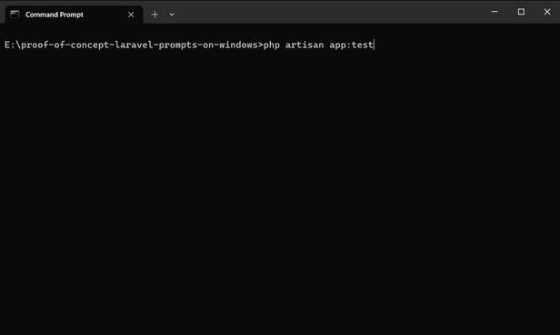
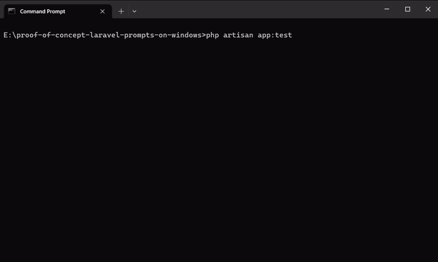

# Proof of concept of laravel/prompts on Windows command line

## About

This is a proof of concept that shows that it is possible to use intearactive command line in Windows if specific support functions are implemented in PHP.

The interactivity is demonstrated on the `app:test` command using the [laravel/prompts](https://github.com/laravel/prompts) package, whose implementation is modified in this project to use PHP with specific support functions.

## Custom build of PHP with support functions

For this laravel/prompts proof of concept, there is a special branch with proof of concept of PHP that implements specific support functions.

The branch with the proof of concept of PHP is available there: https://github.com/ppastercik/php-src/tree/proof-of-concept-laravel-prompts-on-windows

To build this branch on Windows, use [the standard Windows build process](https://wiki.php.net/internals/windows/stepbystepbuild).

It contains support functions that are implemented similarly to the [`sapi_windows_vt100_support` function](https://www.php.net/manual/en/function.sapi-windows-vt100-support.php). This functions sets/gets the console mode for `STDIN` using the [`SetConsoleMode`](https://learn.microsoft.com/en-us/windows/console/setconsolemode)/[`GetConsoleMode`](https://learn.microsoft.com/en-us/windows/console/getconsolemode) functions.

|Support function name               |Can be used on stream|Gets/sets mode               |
|------------------------------------|---------------------|-----------------------------|
|sapi_windows_echo_input_support     |STDIN that is a TTY  |ENABLE_ECHO_INPUT            |
|sapi_windows_line_input_support     |STDIN that is a TTY  |ENABLE_LINE_INPUT            |
|sapi_windows_processed_input_support|STDIN that is a TTY  |ENABLE_PROCESSED_INPUT       |
|sapi_windows_vt100_input_support    |STDIN that is a TTY  |ENABLE_VIRTUAL_TERMINAL_INPUT|

## Installation of proof of concept

This is a standard project, so install dependencies using the standard PHP build (^8.1):

```cmd
composer install
```

If you want to install dependencies with a custom build of PHP that includes support functions, you must ignore PHP versions because it is forked from the master PHP branch, which is now PHP 8.4.0-dev and not officially supported by dependencies. Therefore, use:
```cmd
composer install --ignore-platform-req=php
```

## Test laravel/prompts with CMD

You can use the full path to custom build of PHP or add it to the `PATH` environment variable by:

```cmd
set PATH={path-to-custom-build};%PATH%
```

Then run the `app:test` command in the project folder.

When using the full PHP path, use:

```cmd
{path-to-custom-build}\php.exe artisan app:test
```

When use PHP in `PATH` environment variable, use:

```cmd
php artisan app:test
```

### Result on PHP with support functions


### Result on PHP without support functions with fallback behavior (current behavior of laravel/prompts on Windows)



### Result on PHP without support functions without fallback behavior



## License

The proof of concept is under the [MIT license](LICENSE.md).
